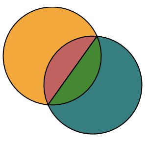

# viewBox

スタート地点から指定した幅・高さの四角で囲んだ範囲をズームして表示

# path

- M (moveTo)
  - スタート座標
- H (horizon)
  - X座標を指定した数に置き換える
- V (vertical)
  - Y座標を指定した数に置き換える
- L (line)
  - 指定した座標まで線を引く
- Z (close path)
  - 最後に指定した座標と最初に指定した座標に線を引きパスを閉じる

次の２つは同じ

```html
<path d="M 10 10 L 150 10 L 150 150 L 10 150"/>
<path d="M 10 10 H 150 V 150 L 10 150"/>
```

## パスで円弧を描く

### C

- 最初の２座標 ベジェ曲線のコントロールポイント
- 最後の座標 エンドポイント

```html
// 閉じない
<path d="M 10 10 C 10 50, 150, 50, 150 10" />
// 閉じる
<path d="M 10 10 C 10 50, 150, 50, 150 10 Z" />
```

### S

- 最初のコントロールポイントを自動で作成。前のエンドポイントを中心に前の２つ目のコントロールポイントの対角に。

```html
// 次の２つは同じ
<path d="M 0 100 C 0 150,150 150, 150 100 S 300 50,300,100" fill="maroon" stroke="red" stroke-width="3"/>
<path d="M 0 100 C 0 150,150 150, 150 100 C 150 50, 300 50,300,100" fill="red" stroke="red" stroke-width="3"/>
```

### Q,T

- Q
  - 円弧の頂点を設定。
- T
  - 前のエンドポイントを中心に前の円弧の２つのコントロールポイントを対角に作成する。
```html
<path d="M 0 150 Q 75 0, 150 150 Q 180 0,210,150"/>
// ※Tは前の円弧の頂点を対角に作るかと最初勘違いしたが、下の290をずらすと頂点がずれる様子を見て認識を修正。
 <path d="M 0 150 Q 75 0, 150 150 T 290 150"/>
```

### A

- rx 円の縦と横の比率
- ry 円の縦と横の比率
- rotation 円の傾き
- large-arc-flag 円を重ねると４つの円弧が出来る。内側と外側どちらの円弧を使うか
- sweep-flag 円弧が上向きか下向きか
- x　エンドポイント
- y　エンドポイント



```html
<svg height="300" width="300">
  <path d="M 50 100
          A 50 50 0 1 1 100 30
          Z"
      fill="orange"
      stroke="black"/>
  <path d="M 50 100
          A 50 50 0 0 1 100 30
          Z"
      fill="indianred"
      stroke="black"/>
  <path d="M 50 100
          A 50 50 0 1 0 100 30
          Z"
      fill="teal"
      stroke="black"/>
  <path d="M 50 100
          A 50 50 0 0 0 100 30
          Z"
      fill="forestgreen"
      stroke="black"/>
</svg>
```


# polygon vs path